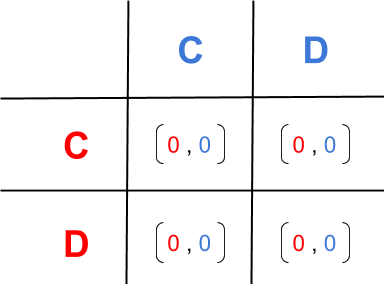

# Monte Carlo Tournament #

Implementation for Master's Thesis.
# Theory #
Simple game(no utilities):

# Implementation #

Check monteCarlo_tour.py docstrings.

## Purpose ##

Pin strategies against each other for a random number of turns and matches.  
Outputs the results in a df which is further exported into csv format.  
Results in local tmp folder.

## Experiments ##

Run multiple monte carlo tournaments having different random number of turns and matches.

## Results ##

Here is a GIF displaying the results from a test run.  
There are 5 seconds/run.
